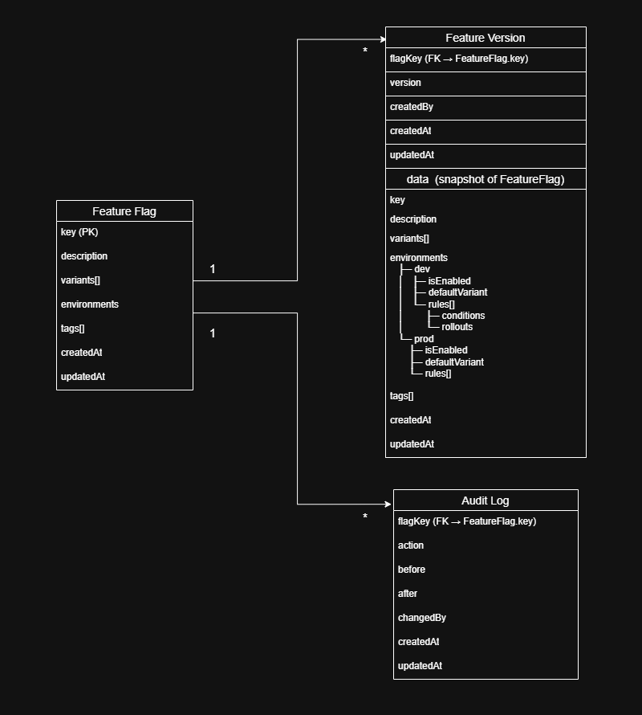

# Feature Flag System

**A production-grade feature flag system built with Node.js and TypeScript, featuring a rule-based evaluation engine, Redis-backed caching, and a type-safe JavaScript SDK for safe, controlled feature rollouts.**

This project is a developer platform for managing feature flags, rollouts, and experiments in real time - similar in concept to tools like **LaunchDarkly** or **Unleash**.

It enables teams to:
- Ship features safely
- Target specific users or regions
- Run percentage rollouts and A/B tests
- Instantly rollback or disable features without redeploying

---

## 🚀 What this platform does

Applications use a JavaScript SDK to fetch feature flags at runtime.  
Flags are evaluated on the server using rule-based logic and rollout percentages, then cached for high-performance reads.

It supports:
- Multi-variant flags (not just booleans)
- Environment-based configuration (dev / prod)
- User targeting and segmentation
- Versioned updates with rollback
- Audit logging
- Redis-backed low-latency evaluation

---

## 🏗 System Architecture
  

The platform is built as a centralized configuration and rollout service with a lightweight client SDK.

High-level flow:

    Client App  
        ↓
    JavaScript SDK (in-memory cache + polling)  
        ↓
    Feature Flag API (Node.js + TypeScript)  
        ↓                   ↓
    Redis (hot cache)       MongoDB (source of truth)
        


### Runtime (Read Path)
1. The application calls `getFlag(key)`
2. The SDK checks its in-memory cache
3. If stale or missing, it calls the Feature Flag API
4. The API checks Redis
5. On a cache miss, it reads MongoDB, evaluates rules, and stores the result in Redis
6. The SDK returns the final variant and value

### Control Plane (Write Path)
1. Admin tools or automation call the API to create, update, rollback, or disable a flag
2. The API writes a new version to MongoDB
3. Redis cache entries are invalidated so apps receive the new config
---

## 🧩 Data Model
  
The platform uses a versioned configuration model.

### FeatureFlag
Represents the identity of a feature.

- `key` (primary key, immutable)
- `description`
- `variants`
- `environments` (dev, prod) — environment-specific enablement, rules, and rollouts
- `tags`
- `createdAt`, `updatedAt`

### FlagVersion
Each change creates a new version.

- `flagKey` (foreign key → FeatureFlag.key)
- `version`
- `data` (snapshot of full FeatureFlag config)
- `createdBy`
- `createdAt`, `updatedAt`

Rollbacks create a new version copied from an older version.  
Disabling a flag creates a new version with `isEnabled: false`.

### AuditLog
Tracks every change.

- `flagKey` (foreign key)
- `action` (CREATE, UPDATE, ROLLBACK, DISABLE)
- `before` (full FeatureFlag configuration before the change)
- `after`  (full FeatureFlag configuration after the change)
- `changedBy`
- `createdAt`, `updatedAt`

This provides full traceability and safe production usage.

---

## 📡 API Documentation

The complete REST API is documented on Postman:

[Api Docs Link](https://documenter.getpostman.com/view/46274146/2sBXVfkCRY)

It includes:
- Flag management (create, update, rollback, disable)
- Flag evaluation
- Audit log access
- Example requests and responses
- Typical workflows

---

## 📦 JavaScript SDK

A lightweight, TypeScript-first SDK is provided for consuming flags from applications.

The SDK lives inside this repo and can be used locally via `npm link` or workspace linking.

### Using the SDK locally
From the SDK folder:

```bash
npm install
npm link
```

From any app that wants to use it:
```bash
npm link @varun-taneja/feature-flag-sdk   
```

#### Initialization
```js
import { FeatureFlagClient } from "@varun-taneja/feature-flag-sdk";

const client = new FeatureFlagClient({
  baseUrl: "http://localhost:8080/api",
  environment: "prod",
  user: { userId: "user_123", region: "US" },
  pollingInterval: 10000
});
```

#### Fetching a flag
```js 
const enabled = await client.getFlag<boolean>("checkout_v4");
```

#### Type-safe usage
```js
const discount = await client.getFlag<number>("discount_percentage");
const theme = await client.getFlag<"light" | "dark">("theme");
```

#### The SDK:
- Uses an in-memory cache for O(1) reads
- Polls the API for updates
- Automatically picks up rollbacks and disables
- Works in web apps, Node.js services, and serverless functions


## 🛠 Running Locally
```bash
git clone https://github.com/Varun-Taneja/Feature-Flag-System.git
cd Feature-Flag-System
npm install
npm run dev
```

#### Requires:
- MongoDB
- Redis

### Configure `.env`:
```
MONGO_URI= your_mongodb_connection_string
REDIS_URL= your_redis_connection_string
```
### 🎯 Why this project matters

This project focuses on several backend and platform engineering concerns, including:

- Distributed caching
- Versioned configuration
- Rule-based evaluation
- Percentage-based rollouts
- Audit logging

It is designed to reflect how feature flag and configuration platforms are built and used in real production environments.

### 📚 Credits & Acknowledgements
Inspired by real-world feature flag platforms such as **LaunchDarkly** and **Unleash**.

Built and maintained by **Varun Taneja**.